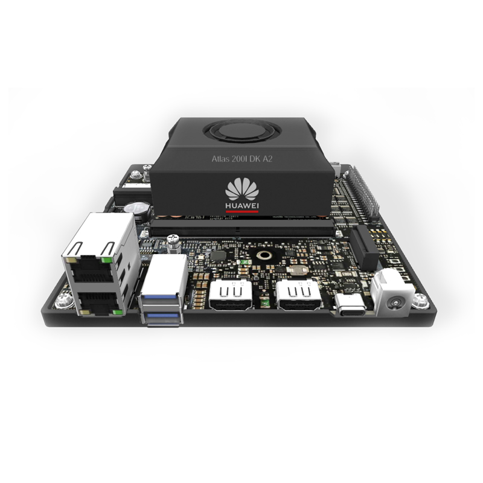
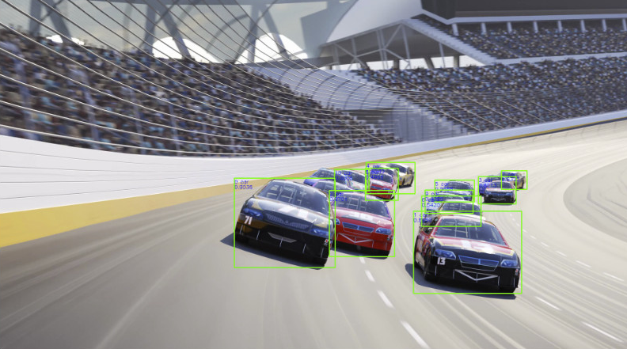
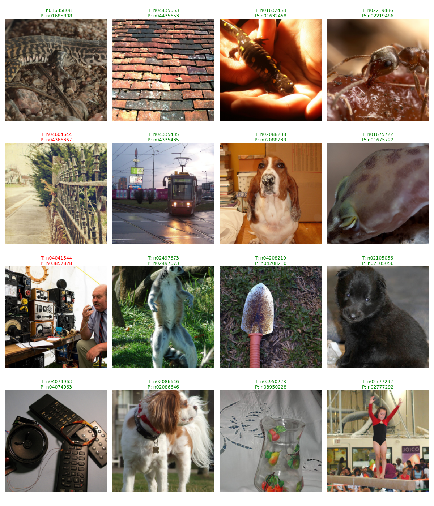
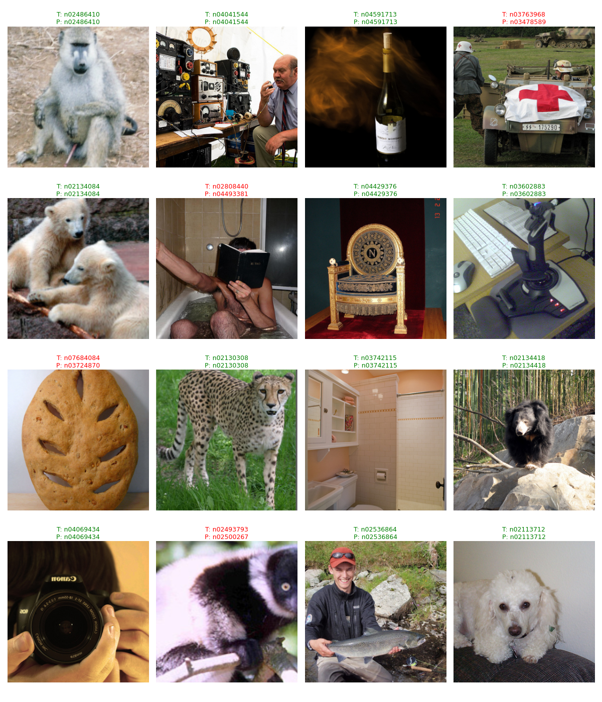
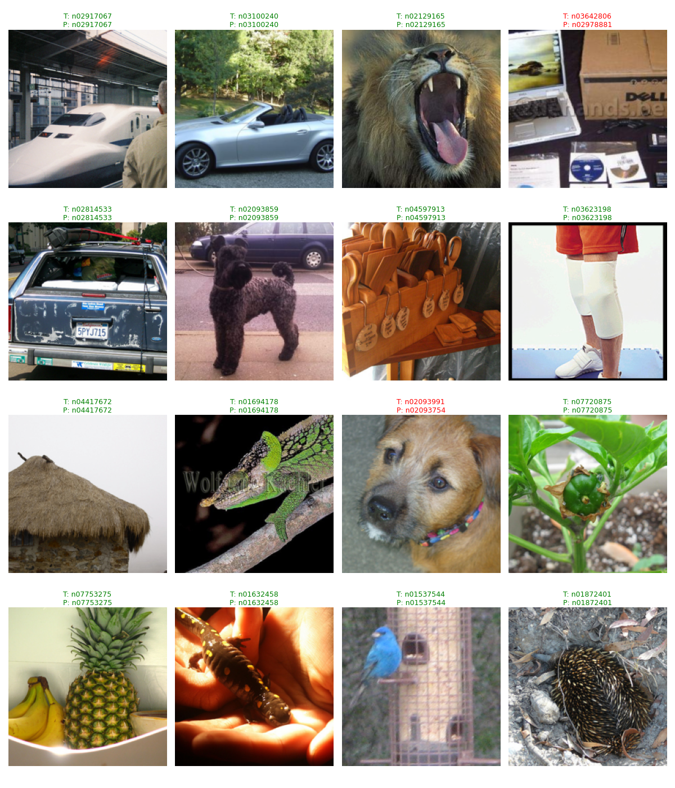
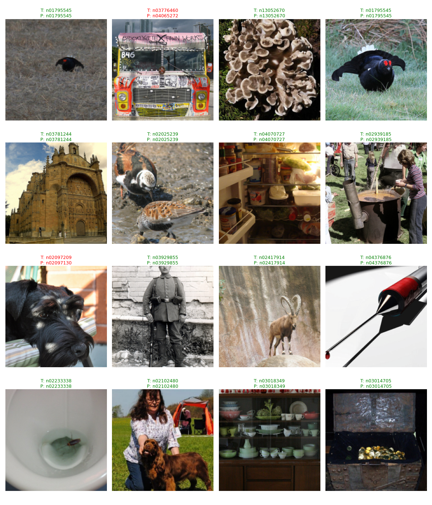

# Omni-Infer-Ascend

Omni-Infer-Ascend 是一个基于昇腾（Ascend）NPU 的推理项目集合，其中包含了多个不同的推理项目，且不同的项目都有各自的 README.md 文件。

## 项目总览

目前其中包含的项目如下：

| 项目名称 | 项目介绍 | 设备 |
| -------- | -------- | ---- |
| [Distributed-NPU-Inference](./Distributed-NPU-Inference) | 分布式 yolov5 推理项目 | 310B * N |
| [bench_01_resnet](./bench_01_resnet) | ResNet 模型推理项目 | 310P |
| [bench_02_efficientnet](./bench_02_efficientnet) | EfficientNet 模型推理项目 | 310P |
| [bench_03_vit](./bench_03_vit) | ViT 模型推理项目 | 310P |
| [bench_04_swin_transformer](./bench_04_swin_transformer) | Swin Transformer 模型推理项目 | 310P |

## 项目设备

### 310B

310B 设备主要是基于 Atlas 200I DK A2 完成的。



### 310P

310P 设备主要是使用的香橙派 AI Studio 完成的。


## 推理结果展示

### Distributed-NPU-Inference

拆分：

```json
{
  "atlas1": {
    "power": 8,
    "filename": "racing_1.mp4"
  },
  "atlas": {
    "power": 20,
    "filename": "racing_2.mp4"
  }
}
```

分布式推理并合并：



### bench_01_resnet



### bench_02_efficient_net



### bench_03_vit



### bench_04_swin_transformer




