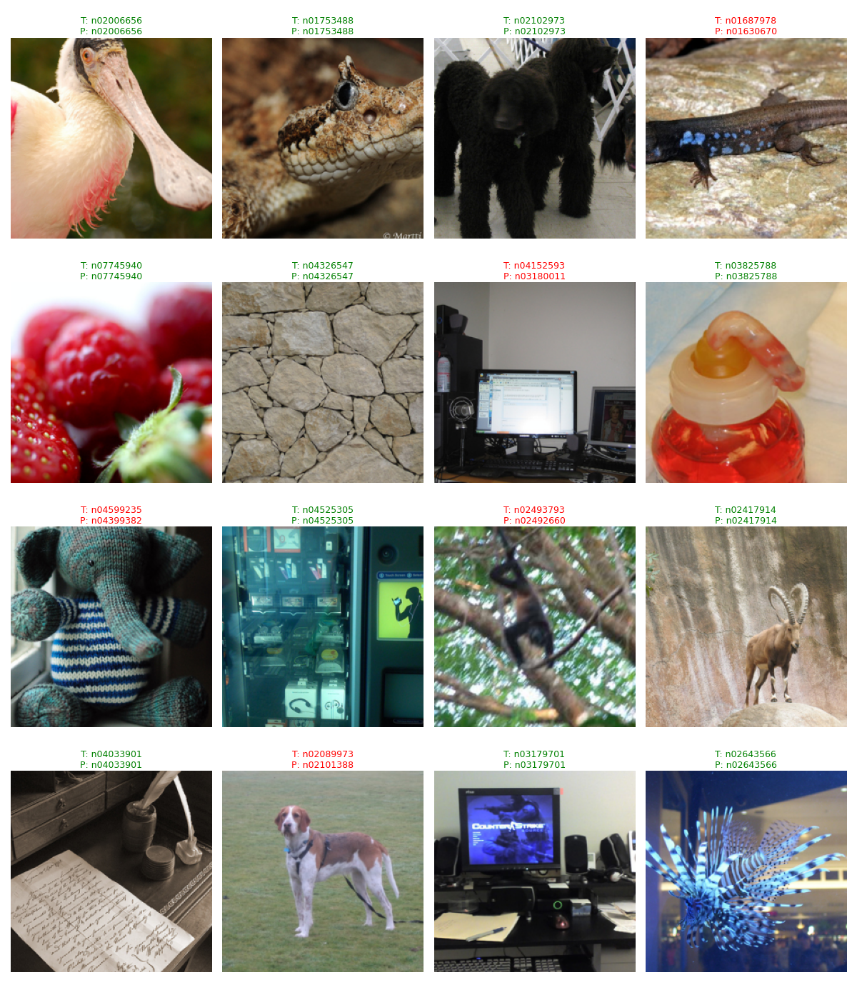
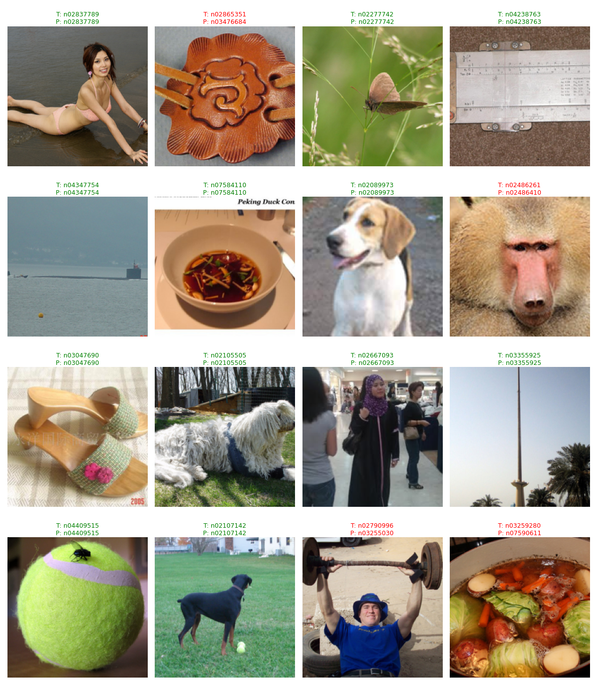
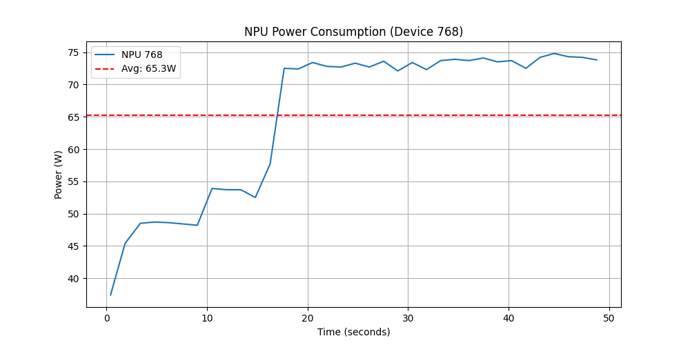

# bench_03_vit

## 项目介绍

bench_03_vit 是一个基于 ViT 模型的推理项目，用于在昇腾 Ascend NPU(310P) 上进行 ViT 模型的推理。

项目目录树：

```bash
bench_03_vit/
├── bench_resize.py             # 测试不同的 resize 输入对推理性能的影响
├── calculate_flops.py          # 用于计算模型的 FLOPs
├── config.py                   # 配置文件，包含模型、数据集、推理参数等
├── data_loader.py              # 数据加载器，用于加载数据集
├── download_vit.py             # 用于下载 ViT 模型
├── inference_engine.py         # 推理引擎，用于进行模型推理
├── infer_om.py                 # 用于对 OM 模型进行推理
├── infer_onnx.py               # 用于对 ONNX 模型进行推理
├── infer_onnx_with_output.py   # 用于对 ONNX 模型进行推理，并保存输出结果
├── infer.py                    # 用于对 PT 模型进行推理
├── model_loader.py             # 模型加载器，用于加载模型
├── npu_monitor.py              # NPU 监控器，用于监控 NPU 资源使用情况
├── pt2onnx.py                  # 用于将 PT 模型转换为 ONNX 模型
├── result_saver.py             # 结果保存器，用于保存推理结果
├── server.py                   # 推理服务器，用于提供推理服务
└── vis_results                 # 可视化结果目录，用于存储可视化结果
```

## 测试结果






## 功耗采集


